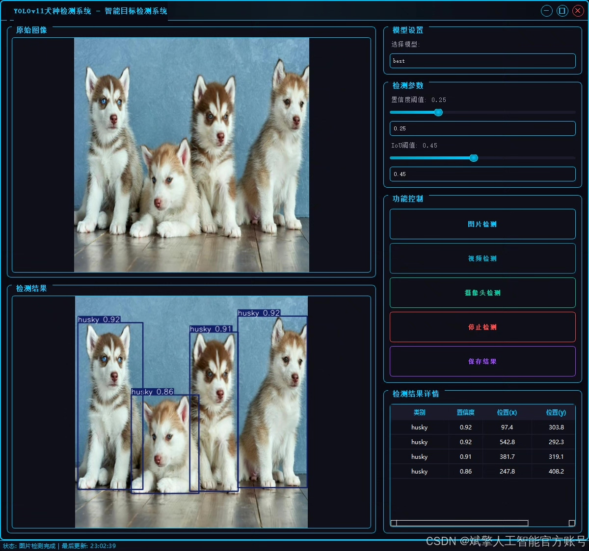
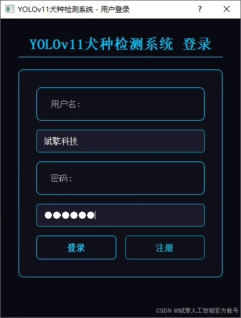
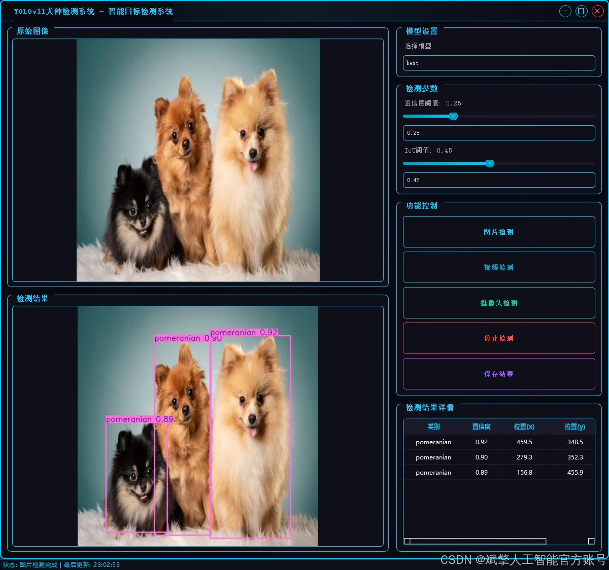
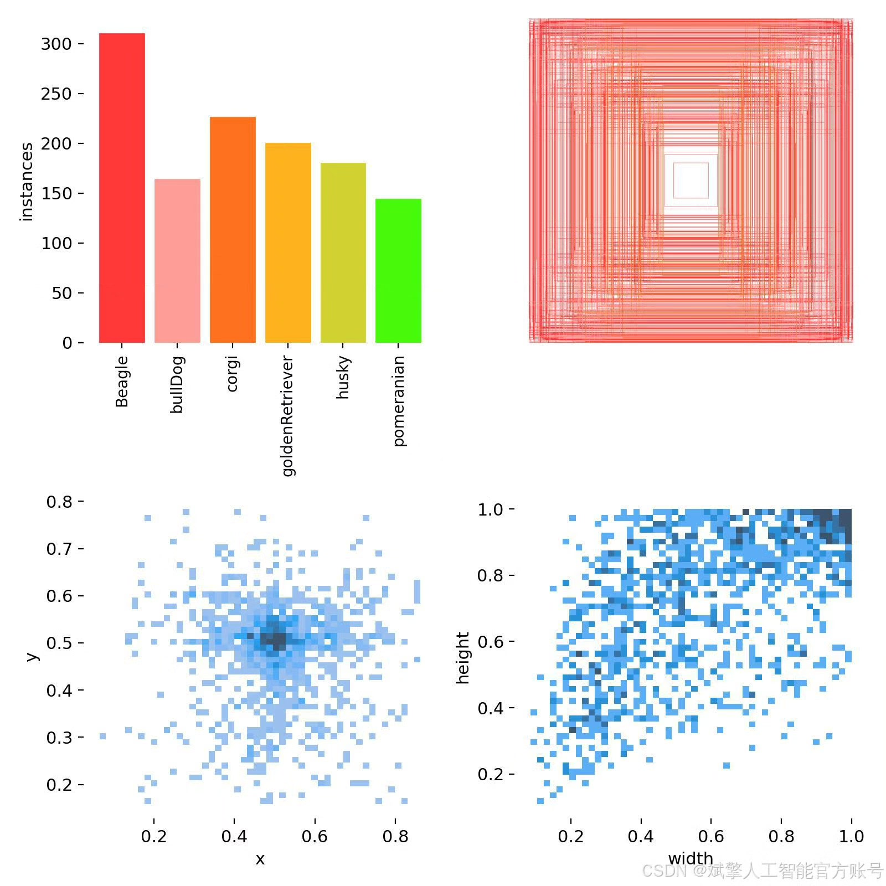
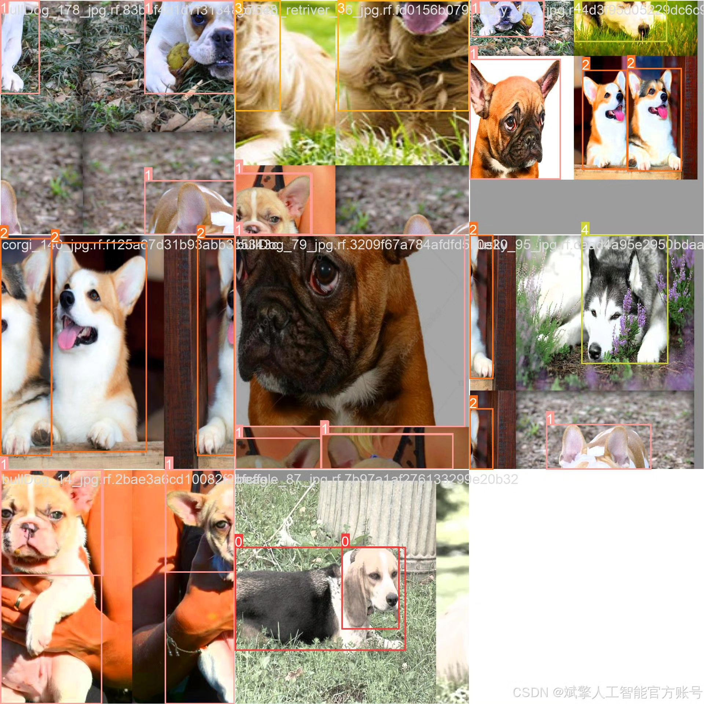
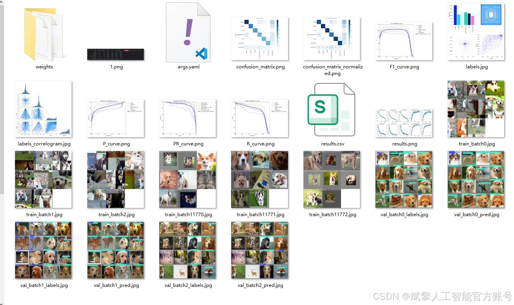
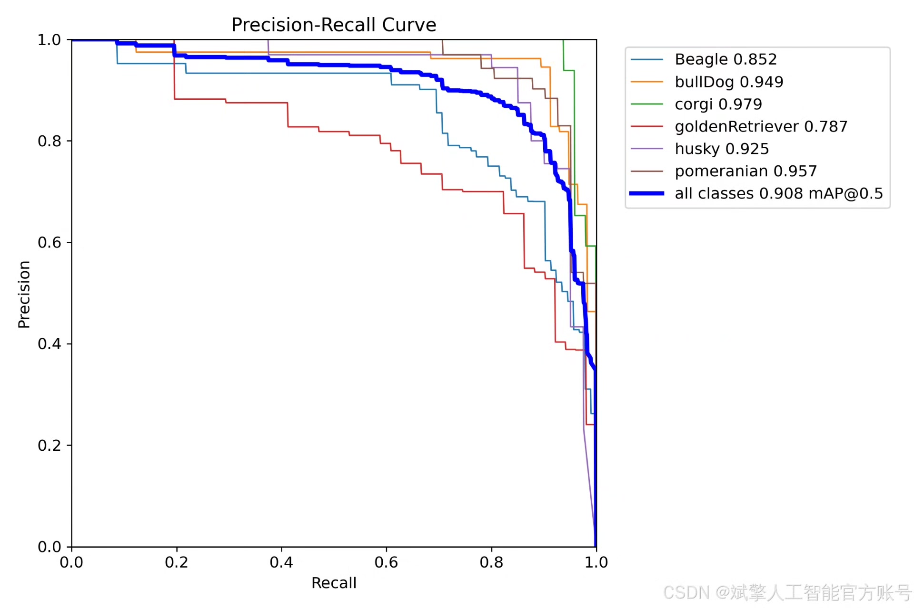
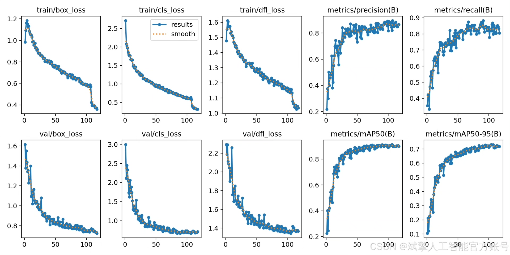
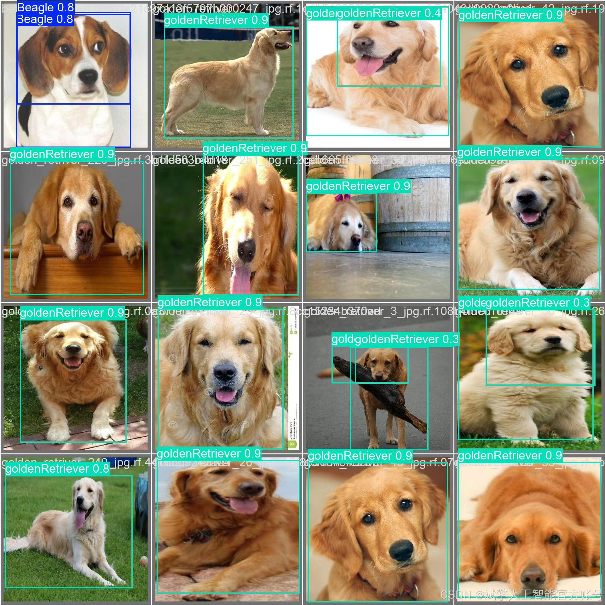

# YOLOv11 Dog Breed Identification System

## Body

YOLOv11 Dog Breed Identification System based on Deep Learning YOLOv11, Dataset + UI Interface + Login and Registration Interface + Python Project Source Code + Model

The project aims to develop a dog breed automatic recognition system based on the YOLOv11 object detection algorithm. This system can detect dogs in images or videos in real-time and accurately identify them belonging to six specific breeds: Beagle, Bulldog, Corgi, Golden Retriever, Husky, and Pomeranian.

The core of the project uses the advanced YOLOv11 model, which achieves an excellent balance between speed and accuracy, making it very suitable for practical deployment applications. The system has been trained and optimized on a professional dataset totaling 1257 images, achieving good performance metrics on an independent test set, with average precision (mAP) and recall (Recall) both performing well. This achievement can be widely applied in fields such as pet smart management, pet community applications, animal research, and intelligent security monitoring, providing an efficient and reliable technical solution for automated dog breed recognition.

Dataset:
nc: 6
names: ['Beagle', 'bullDog', 'corgi', 'goldenRetriever', 'husky', 'pomeranian'],
dataset quantity: training set 880, validation set 251, test set 126

✅ User login registration: Supports password detection and security verification.
✅ Three detection modes: Based on the YOLOv11 model, supports image, video, and real-time camera detection, accurately identifying targets.
✅ Dual-screen comparison: Displays the original scene and detection results on the same screen.
✅ Data visualization: Real-time table displaying the category, confidence, and coordinates of detected targets.
✅ Intelligent parameter adjustment: Offers a confidence slide bar, dynamically optimizing detection accuracy to meet different scene needs.
✅ Sci-fi interface: Dark theme combined with dynamic light effects, reducing visual fatigue and improving operational experience.

## Images

## Payment

Here is a pay link on Stripe ( https://buy.stripe.com/3cs8yP7sY87d0vu9AB ). Please contact me lonlonago@foxmail.com after funding $89, and I will send you a complete data files , thank you!

